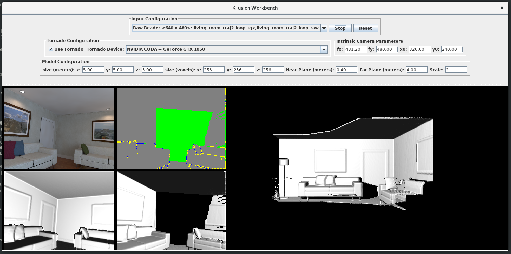

# KFusion-TornadoVM #

A Java implementation of the Kinect Fusion application running on TornadoVM. It can run on existing datasets as well as in real-time with input frames from an attached RBG-d camera. Detailed explanation and performance evaluation can be found in the following [publication](https://www.researchgate.net/publication/327097904_Exploiting_High-Performance_Heterogeneous_Hardware_for_Java_Programs_using_Graal).

### Releases
  * KFusion-TornadoVM 0.1.0 - 11/02/2019: Initial release of Kinect Fusion on TornadoVM.
  
## Output ##

If you enable the GUI while running KFusion you will see a real-time 3D space reconstruction similar to the image below:



In addition, you will see output text with performance metrics across the frames that KFusion processes:
```bash
frame	acquisition	preprocessing	tracking	integration	raycasting	rendering	computation	total    	X          	Y          	Z         	tracked   	integrated
0	0.006214	0.003313	0.016029	0.027997	0.000000	0.001509	0.047339	0.055061	0.000000	0.000000	0.000000	0	1
1	0.000499	0.000389	0.002222	0.000608	0.000000	0.000000	0.003220	0.003719	0.000000	0.000000	0.000000	0	1
2	0.000409	0.000418	0.002108	0.000618	0.000000	0.000000	0.003144	0.003554	0.000000	0.000000	0.000000	0	1
3	0.000584	0.000431	0.003003	0.000593	0.000552	0.000000	0.004579	0.005163	0.000000	0.000000	0.000000	0	1
4	0.000665	0.000422	0.013228	0.000599	0.000369	0.000310	0.014618	0.015592	-0.004392	0.001433	0.000935	1	1
...
Summary: time=6.50, frames=882, FPS=135.79
```
  
## How to start? ##

This implementation runs on TornadoVM to achieve GPU acceleration and real-time performance.
Hence, you need to install [Tornado](https://github.com/beehive-lab/Tornado) following the instructions from [Tornado-INSTALL](https://github.com/beehive-lab/Tornado/blob/master/INSTALL.md)

After you successfully build Tornado, you can install KFusion-TornadoVM by issuing the following commands:


##### Dependencies:

```bash
sudo dnf install -y yaml-cpp-devel gtk2-devel mesa-libEGL-devel vtk-devel cmake make git mercurial wget unzip gcc gcc-c++ lapack blas lapack-devel blas-devel findutils cvs glut-devel glew-devel boost-devel glog-devel gflags-devel libXmu-devel
```


Then install KFUSION-TornadoVM

```bash
# Setup:
export KFUSION_ROOT="${PWD}"
export PATH="${PATH}:${KFUSION_ROOT}/bin"
export JAVA_HOME=/path/to/graal/jdk1.8.0_131
export TORNADO_ROOT=/path/to/tornado
export PATH="${PATH}:${TORNADO_ROOT}/bin/bin/"
export TORNADO_SDK=${TORNADO_ROOT}/bin/sdk

## Compile and run KFusion-TornadoVM
$ mvn clean install -DskipTests

## Run KFusion-TornadoVM GUI 
$ kfusion kfusion.tornado.GUI

## Run Benchmarking mode
$ kfusion kfusion.tornado.Benchmark <config file>
```

## How to get the datasets? 

KFusion-Tornado uses the [ICL-NUIM](https://www.doc.ic.ac.uk/~ahanda/VaFRIC/iclnuim.html) datasets.<br>
We provide a script to automatically download and compose the video files in `raw` format. <br>
Alternatively, when running the Java program (KFusion-TornadoVM) the first time, it will download the corresponding video raw-file and install it locally. 

### Option a) Automatically

The first time you run the application and if the raw file is not installed locally (`~/.kfusion_tornado`), then the program will ask you if you want to download it auotmatically:

```bash
$ kfusion kfusion.tornado.Benchmark conf/bm-traj3.settings 
KFussion Accelerated with Tornado
	: Reading configuration file: /home/juan/.kfusion_tornado/living_room_traj3_loop.raw
Data Set file does not exist. Do you want to download it automatically? (~2GB) 
Press [yes/no] (default: yes) : 
```

### Option b) Manually

Run the `downloadDataSets.sh <url> <fileName>`, for example:

```bash
$ bash downloadDataSets.sh  http://www.doc.ic.ac.uk/~ahanda/living_room_traj2_loop.tgz living_room_traj2_loop.raw
```

## Running KFusion-Tornado ##

KFusion can run in two modes receiving input from:

1) RGB-d camera where you select the input source from the drop-down menu:
```bash
## Run KFusion-Tornado GUI 
$ kfusion kfusion.tornado.GUI
```

2) Pre-defined datasets again through the GUI selection or:
```bash
## Run KFusion-Tornado GUI 
$ kfusion kfusion.tornado.Benchmark <config file>
```
In our examples, we use images from the [ICL-NUIM](https://www.doc.ic.ac.uk/~ahanda/VaFRIC/iclnuim.html) dataset which will be downloaded automatically when issuing the following command:

```bash
$ kfusion kfusion.tornado.Benchmark conf/bm-traj2.settings 
```

Note: 
* Sample configuration files are under the `conf/` directory.


## Selected Publications

* James Clarkson, Juan Fumero, Michalis Papadimitriou, Foivos S. Zakkak, Maria Xekalaki, Christos Kotselidis, Mikel Luján (The University of Manchester). **Exploiting High-Performance Heterogeneous Hardware for Java Programs using Graal**. *Proceedings of the 15th International Conference on Managed Languages & Runtime.* [preprint](https://www.researchgate.net/publication/327097904_Exploiting_High-Performance_Heterogeneous_Hardware_for_Java_Programs_using_Graal)

* Sajad Saeedi, Bruno Bodin, Harry Wagstaff, Andy Nisbet, Luigi Nardi, John Mawer, Nicolas Melot, Oscar Palomar, Emanuele Vespa, Tom Spink, Cosmin Gorgovan, Andrew Webb, James Clarkson, Erik Tomusk, Thomas Debrunner, Kuba Kaszyk, Pablo Gonzalez-de-Aledo, Andrey Rodchenko, Graham Riley, Christos Kotselidis, Björn Franke, Michael FP O'Boyle, Andrew J Davison, Paul HJ Kelly, Mikel Luján, Steve Furber. **Navigating the Landscape for Real-Time Localization and Mapping for Robotics and Virtual and Augmented Reality.** In Proceedings of the IEEE, 2018.

* C. Kotselidis, J. Clarkson, A. Rodchenko, A. Nisbet, J. Mawer, and M. Luján. **Heterogeneous Managed Runtime Systems: A Computer Vision Case Study.** In Proceedings of the 13th ACM SIGPLAN/SIGOPS International Conference on Virtual Execution Environments, VEE ’17, [link](https://dl.acm.org/citation.cfm?doid=3050748.3050764)

### Citation

Please use the following citation if you use Tornado in your work.

```bibtex
@inproceedings{Clarkson:2018:EHH:3237009.3237016,
 author = {Clarkson, James and Fumero, Juan and Papadimitriou, Michail and Zakkak, Foivos S. and Xekalaki, Maria and Kotselidis, Christos and Luj\'{a}n, Mikel},
 title = {{Exploiting High-performance Heterogeneous Hardware for Java Programs Using Graal}},
 booktitle = {Proceedings of the 15th International Conference on Managed Languages \& Runtimes},
 series = {ManLang '18},
 year = {2018},
 isbn = {978-1-4503-6424-9},
 location = {Linz, Austria},
 pages = {4:1--4:13},
 articleno = {4},
 numpages = {13},
 url = {http://doi.acm.org/10.1145/3237009.3237016},
 doi = {10.1145/3237009.3237016},
 acmid = {3237016},
 publisher = {ACM},
 address = {New York, NY, USA},
 keywords = {Java, graal, heterogeneous hardware, openCL, virtual machine},
} 
```

## Acknowledgments

This work was initially supported by the EPSRC grants [PAMELA EP/K008730/1](http://apt.cs.manchester.ac.uk/projects/PAMELA/) and [AnyScale Apps EP/L000725/1](http://anyscale.org), and now it is funded by the [EU Horizon 2020 E2Data 780245](https://e2data.eu) and the [EU Horizon 2020 ACTiCLOUD 732366](https://acticloud.eu) grants.

## Collaborations

For academic collaborations please contact [Christos Kotselidis](https://www.kotselidis.net).


## Users Mailing list

A mailing list is also available to discuss Tornado related issues:

tornado-support@googlegroups.com

## Contributors 

This work was originated by James Clarkson and it is currently maintained by:

* [Juan Fumero](https://jjfumero.github.io/)
* [Michail Papadimitriou](https://mikepapadim.github.io)
* [Maria Xekalaki](https://github.com/mairooni)
* [Christos Kotselidis](https://www.kotselidis.net)

## License

The work is published under the Apache 2.0 license: [](https://opensource.org/licenses/Apache-2.0)
